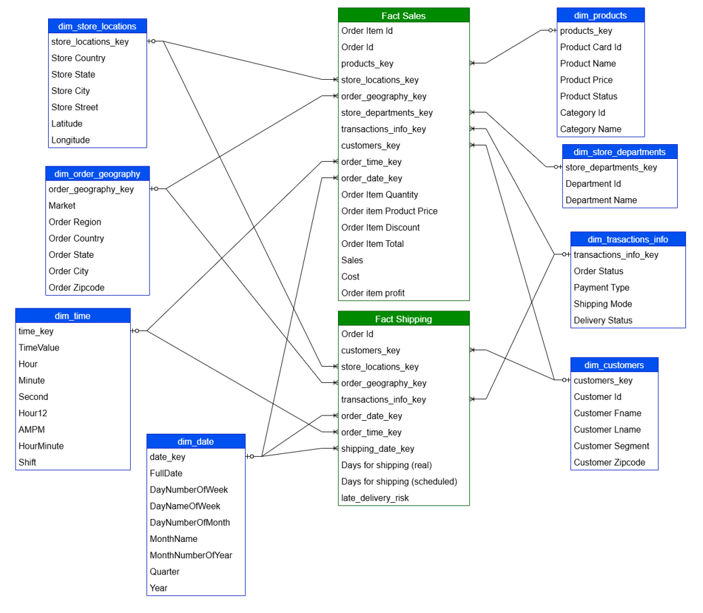
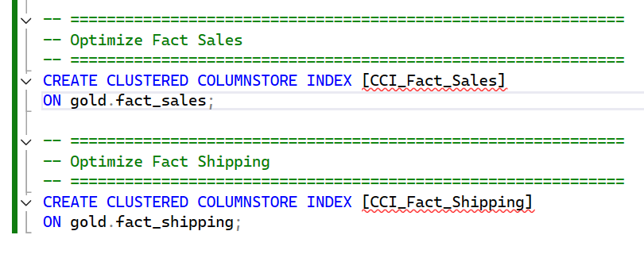

# Data Warehouse Implementation
The approach we followed to build this data warehouse is the Medallion Architecture, where we design three layers: the Bronze layer (Staging), the Silver layer (Transformations), and the Gold layer (Reporting & Advanced Analytics).

#### Data Warehouse Architecture Diagram
### **ETL Strategy: Full Load (Truncate & Load)**
* For this solution, I implemented a **Full Load** strategy across the Silver and Gold layers. This involves truncating the destination tables and reloading the complete dataset during every scheduled refresh.
#### **Why this strategy?**
* **Data Consistency:** Guarantees 100% synchronization with the source system, eliminating the risk of data drift or "ghost records" (records deleted in source but remaining in the warehouse).
* **Simplicity & Maintainability:** Reduces the complexity of the ETL pipeline by removing the need for watermark tracking (`LastModifiedDate`) or complex `MERGE` logic.
* **Performance Context:** Given the dataset volume (< 5M rows), the SQL Server `TRUNCATE` and `INSERT` operations complete in under 2 minutes, making the computational overhead of incremental logic unnecessary for this specific use case.

# **Naming Conventions**

## **Table Naming Conventions**

In this project, we will use snake_case as the naming convention for all objects, except for the bronze and silver layers where we will keep the column names as they appear in the source.

### **Bronze Rules**

* All names must start with the source system name, and table names must match their original names without renaming.
* **Format:** `<sourcesystem>_<entity>`

  * `<sourcesystem>`: Name of the source system (e.g., `crm`, `erp`).
  * `<entity>`: Exact table name from the source system.
  * **Example:** `crm_customer_info` → Customer information from the CRM system.

### **Silver Rules**

* All names must start with the source system name, and table names must match their original names without renaming.
* **Format:** `<sourcesystem>_<entity>`

  * `<sourcesystem>`: Name of the source system (e.g., `crm`, `erp`).
  * `<entity>`: Exact table name from the source system.
  * **Example:** `crm_customer_info` → Customer information from the CRM system.

### **Gold Rules**

* All names must use meaningful, business-aligned names for tables, starting with a category prefix.
* **Format:** `<category>_<entity>`

  * `<category>`: Describes the role of the table, such as `dim` (dimension) or `fact` (fact table).
  * `<entity>`: Descriptive name of the table, aligned with the business domain (e.g., customers, products, sales).
  * **Examples:**

    * `dim_customers` → Dimension table for customer data.
    * `fact_sales` → Fact table containing sales transactions.

## **Column Naming Conventions**

### **Surrogate Keys**

* All primary keys in dimension tables must use the suffix `_key`.
* **Format:** `<table_name>_key`

  * `<table_name>`: The name of the table or entity the key belongs to.
  * `_key`: A suffix indicating that this column is a surrogate key.
  * **Example:** `customer_key` → Surrogate key in the `dim_customers` table.

### **Technical Columns**

* All technical columns start with the prefix `dwh_`, followed by a descriptive name indicating the column's purpose.
* **Format:** `dwh_<column_name>`

  * `dwh`: Prefix exclusively for system-generated metadata.
  * `<column_name>`: Descriptive name indicating the column’s purpose.
  * **Example:** `dwh_load_date` → System-generated column used to store the date when the record was loaded.

### **Stored Procedures**

* All stored procedures used for loading data must follow the naming pattern:
* **Format:** `load_<layer>`

  * `<layer>`: Represents the layer being loaded, such as `bronze`, `silver`, or `gold`.
  * **Examples:**

    * `load_bronze`
    * `load_silver`
    * `load_gold`

# **Bronze Layer Implementation**

Bronze Layer specifications:
* We simply need to load the data from the source systems into the data warehouse.
* We will perform a full load (truncate and then insert).
* No data transformations will be applied.
* No new data model will be created.

The implementation scripts are organized as follows:
- `scripts/bronze_ddl.sql`: Defines the DDL statements used to create the Bronze Layer tables.
- `scripts/load_bronze.sql`: Contains the logic for extracting and loading data from the source systems into the Bronze Layer.
- `scripts/validate_bronze.sql`: Includes the validation queries used to verify data integrity after loading.

# **Silver Layer Implementation**
Before starting the implementation of the Silver Layer, where all data transformations are performed, we need to examine the data at the bronze layer and understand how the different source systems are integrated.

Let’s review the data in each Bronze table to determine which transformations are needed and whether each column should be kept or removed.

### **crm_customers**

* Drop `Customer Email` and `Customer Password`.
* The primary key contains duplicate rows.
* The `Customer Segment` column has inconsistency issues.
* The first and last names contain both title-case and lowercase values.
* Add leading zeros to the Zipcode and remove the `.0`.

### **erp_departments**

* No issues.

### **erp_locations**
* Create a new primary key to replace the three columns (`Customer State`, `Customer City`, `Customer Street`) used to link order headers to the locations table, in order to improve performance.
* Replace `EE. UU.` with `United States` to make the value clearer for the user.
* The `Customer State` column contains two ZIP code values that need to be replaced with the correct state.
  We will identify the state from the customer city.
  The customer mistakenly entered:

  * the ZIP code in the *state* field,
  * the state in the *city* field,
  * and the city in the *street* field.

### **erp_order_headers**
* Apply the same transformations we applied to `Customer State`, `Customer City`, and `Customer Street` so the values match when joining the two tables.
* Create a new `Region` column that provides a clearer and more accurate categorization of regions.

### **erp_order_items**
* Drop the `Sales per customer` column because it contains the same data as the `Order Item Total` column.
* Drop the `Benefit per Order` column because it contains the same data as the `Order Profit per` Order column.
* Calculate the missing sales values using the formula: `Quantity * Price`.

### **erp_categories**
* The `Electronics` category appears with two different primary keys in the table. We will keep 13 as the primary key for `Electronics` and update the other key to 13 in both the `erp_categories` table and the `erp_products` table.
* Add a new category called `Unknown` with a primary key of -1 to be used for products that are not assigned to any category.

### **erp_products**
* Set `Category Id` to -1 for products where `Category Id` is NULL.
* Set `Category Id` values of 37 to 13, since 13 is the only primary key retained for the `Electronics` category.

### **erp_shipping**
* We checked that the shipping date is the actual data of shipping date.

After we investigated the data in the Bronze layer, we started to apply our transformations and load the data into the Silver layer.

The implementation scripts of the Silver layer are organized as follows:
- `scripts/silver_ddl.sql`: Defines the DDL statements used to create the Silver Layer tables.
- `scripts/load_silver.sql`: Contains the logic for extracting and loading data from the Bronze Layer into the Silver Layer.
- `scripts/validate_silver.sql`: Includes the validation queries used to verify data integrity after loading.

# **Gold Layer Implementation**

Before implementing the Gold Layer, it is essential to design the data model that will support analysis and reporting. Following the Kimball methodology, we developed two subject-area data marts, Sales and Shipping, which form a multi-fact star schema (also known as a galaxy schema).

In this model, there are 8 dimensions and 2 fact tables. This design is critical because it solves the "mixed granularity" problem in our source data, leading to a model that is fast, efficient, and accurate.

### Fact Tables (The "What")

The core of the model is split into two fact tables, each representing a different business event at its natural level of detail (or "grain").

1.  **`Fact_Sales` (Item Grain)**
    * **Purpose:** This table is the "shopping cart" and contains one row for *every single item* on an order.
    * **Measures:** It holds all item-level measures like `Sales`, `Cost`, `Order Item Quantity`, and `Order Item profit`.

2.  **`Fact_Shipping` (Order Grain)**
    * **Purpose:** This table contains one row for *every order*.
    * **Measures:** It holds all order-level measures, such as `Days for shipping (real)`, `Days for shipping (scheduled)`, and `late_delivery_risk`.

This separation is the key to the entire model. It prevents order-level metrics (like `late_delivery_risk`) from being duplicated across every item in an order, which will complicate the analysis using DAX and make the size of the model bigger.

### Dimension Tables (The "Who, When, Where")

The model features 8 dimensions that describe the "who, what, when, and where" of the data.

#### Conformed Dimensions
6 dimensions are **conformed**, meaning they connect to *both* fact tables. This is a powerful feature that allows a single slicer in Power BI to filter both sales and shipping data at the same time.
* `dim_customers`
* `dim_store_locations`
* `dim_order_geography`
* `dim_date` (This is a role-playing dimension, linking to both `order_date_key` and `shipping_date_key`)
* `dim_time`
* `dim_transactions_info` (This is a "Junk Dimension" that combines all low-cardinality status fields like `Order Status`, `Payment Type`, etc.)

#### Private Dimensions
The remaining 2 dimensions are "private," connecting to only one fact table based on the business logic we discovered.

* `dim_products`: Connects **only to `Fact_Sales`**. This is because products are at the item level.
* `dim_store_departments`: Connects **only to `Fact_Sales`**. A single order can contain items from multiple departments, meaning the department is an attribute of the *item*, not the *order*.
  

## Data Flow Diagram
This is a data flow diagram used to track the data and its origin. It is very helpful because if an issue occurs, you can trace the flow backwards from Gold to Silver to Bronze to the Source to identify the root cause.

The implementation scripts of the Silver layer are organized as follows:
- `scripts/gold_ddl.sql`: Defines the DDL statements used to create the Gold Layer tables.
- `scripts/load_gold.sql`: Contains the logic for extracting and loading data from the Silver Layer into the Gold Layer.
- `scripts/validate_gold.sql`: Includes the validation queries used to verify data integrity after loading.

#### **Performance Optimization:** 
Implemented Clustered Columnstore Indexes on all Fact tables. This reduced storage footprint by approximately 80% and enabled Batch Execution Mode, improving aggregation query performance significantly for Power BI DirectQuery and Import refreshes.

